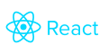

## FRAMEWORKS
<p align="center"><a href="https://laravel.com" target="_blank"></a></p>
<p align="center"><a href="https://react.dev" target="_blank"></a></p>

##
<p align="center"><a href="https://laravel.com" target="_blank"></a></p>

<p align="center">
<a href="https://github.com/laravel/framework/actions"></a>
<a href="https://packagist.org/packages/laravel/framework"></a>
<a href="https://packagist.org/packages/laravel/framework"></a>
<a href="https://packagist.org/packages/laravel/framework"></a>
</p>

## About Laravel

Laravel is a web application framework with expressive, elegant syntax. We believe development must be an enjoyable and creative experience to be truly fulfilling. Laravel takes the pain out of development by easing common tasks used in many web projects, such as:

- [Simple, fast routing engine](https://laravel.com/docs/routing).
- [Powerful dependency injection container](https://laravel.com/docs/container).
- Multiple back-ends for [session](https://laravel.com/docs/session) and [cache](https://laravel.com/docs/cache) storage.
- Expressive, intuitive [database ORM](https://laravel.com/docs/eloquent).
- Database agnostic [schema migrations](https://laravel.com/docs/migrations).
- [Robust background job processing](https://laravel.com/docs/queues).
- [Real-time event broadcasting](https://laravel.com/docs/broadcasting).

Laravel is accessible, powerful, and provides tools required for large, robust applications.

## Learning Laravel

Laravel has the most extensive and thorough [documentation](https://laravel.com/docs) and video tutorial library of all modern web application frameworks, making it a breeze to get started with the framework.

You may also try the [Laravel Bootcamp](https://bootcamp.laravel.com), where you will be guided through building a modern Laravel application from scratch.

If you don't feel like reading, [Laracasts](https://laracasts.com) can help. Laracasts contains thousands of video tutorials on a range of topics including Laravel, modern PHP, unit testing, and JavaScript. Boost your skills by digging into our comprehensive video library.

## Laravel Sponsors

We would like to extend our thanks to the following sponsors for funding Laravel development. If you are interested in becoming a sponsor, please visit the [Laravel Partners program](https://partners.laravel.com).

### Premium Partners

- **[Vehikl](https://vehikl.com)**
- **[Tighten Co.](https://tighten.co)**
- **[Kirschbaum Development Group](https://kirschbaumdevelopment.com)**
- **[64 Robots](https://64robots.com)**
- **[Curotec](https://www.curotec.com/services/technologies/laravel)**
- **[DevSquad](https://devsquad.com/hire-laravel-developers)**
- **[Redberry](https://redberry.international/laravel-development)**
- **[Active Logic](https://activelogic.com)**

## Contributing

Thank you for considering contributing to the Laravel framework! The contribution guide can be found in the [Laravel documentation](https://laravel.com/docs/contributions).

## Code of Conduct

In order to ensure that the Laravel community is welcoming to all, please review and abide by the [Code of Conduct](https://laravel.com/docs/contributions#code-of-conduct).

## Security Vulnerabilities

If you discover a security vulnerability within Laravel, please send an e-mail to Taylor Otwell via [taylor@laravel.com](mailto:taylor@laravel.com). All security vulnerabilities will be promptly addressed.

## License

The Laravel framework is open-sourced software licensed under the [MIT license](https://opensource.org/licenses/MIT).


# [](https://github.com/facebook/react/blob/main/LICENSE) [](https://www.npmjs.com/package/react) [](https://github.com/facebook/react/actions/workflows/runtime_build_and_test.yml) [](https://github.com/facebook/react/actions/workflows/compiler_typescript.yml) [](https://legacy.reactjs.org/docs/how-to-contribute.html#your-first-pull-request)

React is a JavaScript library for building user interfaces.

* **Declarative:** React makes it painless to create interactive UIs. Design simple views for each state in your application, and React will efficiently update and render just the right components when your data changes. Declarative views make your code more predictable, simpler to understand, and easier to debug.
* **Component-Based:** Build encapsulated components that manage their own state, then compose them to make complex UIs. Since component logic is written in JavaScript instead of templates, you can easily pass rich data through your app and keep the state out of the DOM.
* **Learn Once, Write Anywhere:** We don't make assumptions about the rest of your technology stack, so you can develop new features in React without rewriting existing code. React can also render on the server using [Node](https://nodejs.org/en) and power mobile apps using [React Native](https://reactnative.dev/).

[Learn how to use React in your project](https://react.dev/learn).

## Installation

React has been designed for gradual adoption from the start, and **you can use as little or as much React as you need**:

* Use [Quick Start](https://react.dev/learn) to get a taste of React.
* [Add React to an Existing Project](https://react.dev/learn/add-react-to-an-existing-project) to use as little or as much React as you need.
* [Create a New React App](https://react.dev/learn/start-a-new-react-project) if you're looking for a powerful JavaScript toolchain.

## Documentation

You can find the React documentation [on the website](https://react.dev/).

Check out the [Getting Started](https://react.dev/learn) page for a quick overview.

The documentation is divided into several sections:

* [Quick Start](https://react.dev/learn)
* [Tutorial](https://react.dev/learn/tutorial-tic-tac-toe)
* [Thinking in React](https://react.dev/learn/thinking-in-react)
* [Installation](https://react.dev/learn/installation)
* [Describing the UI](https://react.dev/learn/describing-the-ui)
* [Adding Interactivity](https://react.dev/learn/adding-interactivity)
* [Managing State](https://react.dev/learn/managing-state)
* [Advanced Guides](https://react.dev/learn/escape-hatches)
* [API Reference](https://react.dev/reference/react)
* [Where to Get Support](https://react.dev/community)
* [Contributing Guide](https://legacy.reactjs.org/docs/how-to-contribute.html)

You can improve it by sending pull requests to [this repository](https://github.com/reactjs/react.dev).

## Examples

We have several examples [on the website](https://react.dev/). Here is the first one to get you started:

```jsx
import { createRoot } from 'react-dom/client';

function HelloMessage({ name }) {
  return <div>Hello {name}</div>;
}

const root = createRoot(document.getElementById('container'));
root.render(<HelloMessage name="Taylor" />);
```

This example will render "Hello Taylor" into a container on the page.

You'll notice that we used an HTML-like syntax; [we call it JSX](https://react.dev/learn#writing-markup-with-jsx). JSX is not required to use React, but it makes code more readable, and writing it feels like writing HTML.

## Contributing

The main purpose of this repository is to continue evolving React core, making it faster and easier to use. Development of React happens in the open on GitHub, and we are grateful to the community for contributing bugfixes and improvements. Read below to learn how you can take part in improving React.

### [Code of Conduct](https://code.fb.com/codeofconduct)

Facebook has adopted a Code of Conduct that we expect project participants to adhere to. Please read [the full text](https://code.fb.com/codeofconduct) so that you can understand what actions will and will not be tolerated.

### [Contributing Guide](https://legacy.reactjs.org/docs/how-to-contribute.html)

Read our [contributing guide](https://legacy.reactjs.org/docs/how-to-contribute.html) to learn about our development process, how to propose bugfixes and improvements, and how to build and test your changes to React.

### [Good First Issues](https://github.com/facebook/react/labels/good%20first%20issue)

To help you get your feet wet and get you familiar with our contribution process, we have a list of [good first issues](https://github.com/facebook/react/labels/good%20first%20issue) that contain bugs that have a relatively limited scope. This is a great place to get started.

### License

React is [MIT licensed](./LICENSE).

